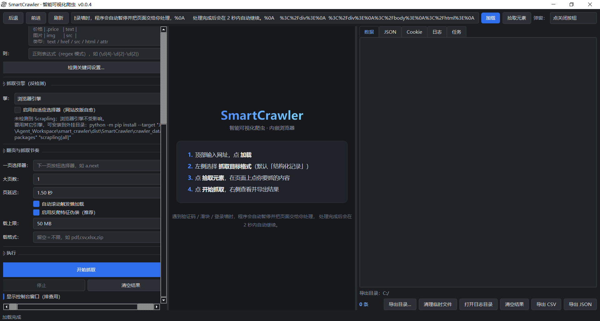

# SmartCrawler 智能可视化爬虫


[](https://github.com/J-R-R-J/smart_crawler/releases/latest)

一个基于 **PySide6 + QtWebEngine** 的桌面爬虫工具：把浏览器内核嵌进界面，所见即所抓；
遇到验证码、人机校验、登录墙或弹窗时自动暂停，把页面交给人处理，处理完自动继续抓取。

适用于需要登录态、需要人工过验证、页面结构不规整的中小规模采集场景。

当前版本 **v0.0.2**，更新内容见 [CHANGELOG.md](CHANGELOG.md)。



---

## 目录

- [下载](#下载)
- [主要特性](#主要特性)
- [环境要求](#环境要求)
- [安装](#安装)
- [快速开始](#快速开始)
- [抓取格式一览](#抓取格式一览)
- [反爬检测与人机协作](#反爬检测与人机协作)
- [反爬对抗机制](#反爬对抗机制)
- [弹窗处理策略](#弹窗处理策略)
- [Profile 与 Cookie 管理](#profile-与-cookie-管理)
- [结果查看与导出](#结果查看与导出)
- [下载限制与临时文件清理](#下载限制与临时文件清理)
- [项目结构](#项目结构)
- [配置说明](#配置说明)
- [扩展开发](#扩展开发)
- [测试](#测试)
- [常见问题](#常见问题)
- [已知限制](#已知限制)
- [版本与更新日志](#版本与更新日志)
- [许可与免责声明](#许可与免责声明)

---

## 下载

### 方式一：下载发布压缩包（推荐）

前往 **[Releases 页面](https://github.com/J-R-R-J/smart_crawler/releases/latest)**，
在 **Assets** 区域下载 `smart_crawler-v0.0.2.zip`：

| 项目 | 说明 |
| --- | --- |
| 文件名 | `smart_crawler-v0.0.2.zip` |
| 大小 | 约 160 KB |
| 内容 | 完整源码（配置 / 核心 / 界面 / 工具 / 测试 / 文档），**不含**虚拟环境与运行时数据 |

解压后直接进入「[安装](#安装)」章节装依赖即可。

### 方式二：克隆仓库

```bash
git clone https://github.com/J-R-R-J/smart_crawler.git
cd smart_crawler
```

### 方式三：下载源码包

在 [Releases 页面](https://github.com/J-R-R-J/smart_crawler/releases/latest) 的
**Source code** 区域可选择 `zip` 或 `tar.gz`（由 GitHub 自动生成，
不包含 Release 附件中的额外说明文件）。

> 无论哪种方式，都需要本机已安装 **Python 3.10+**，并按「安装」章节安装 PySide6 依赖。

---

## 主要特性

| 能力 | 说明 |
| --- | --- |
| 内嵌浏览器 | QtWebEngine（Chromium 内核），渲染结果与手写选择器完全一致 |
| 反爬识别 | 验证码 / 滑块 / 人机校验 / 访问频控 / 登录墙关键词识别 |
| 结构化确认 | 命中关键词后再扫描页面是否真有验证组件（输入框 / 第三方 iframe / 组件容器 / 图形码），区分「已确认」与「疑似」，显著降低误判 |
| 多源检测 | 同时扫描 HTML 源码、页面标题、URL 与**渲染后的可见文本**，并自动忽略零宽字符与空格干扰 |
| 关键词可自定义 | 三类识别关键词均可在界面中编辑，立即生效，无需改代码或重启 |
| 人机协作 | 检测到验证时自动暂停，轮询检测恢复后自动继续，无需重跑任务 |
| 误判可跳过 | 横幅提供「跳过（误判）」按钮，跳过后立即继续且本任务内不再因验证暂停 |
| 可视化拾取 | 点击页面上任意元素自动生成 CSS 选择器，无需手写 |
| 18 种抓取格式 | 覆盖结构化记录、表格、链接、图片、正则、JSON-LD 等常见需求，可扩展 |
| 多格式复选 | 一次勾选多种格式同时提取并合并结果，每条记录带 `_mode` 标记来源 |
| 弹窗处理 | 三种策略可选：只报告 / 点击关闭按钮 / 直接移除 DOM，处理多轮弹窗 |
| 反爬对抗 | 浏览器特征伪装 + 每页延迟随机抖动，降低被风控直接拦截的概率 |
| Cookie 管理 | 表格化查看、编辑、删除、清空、导入、导出，支持会话标记显示 |
| 多 Profile | 不同站点使用不同身份，登录态互相隔离，可新建 / 删除 / 设为默认 |
| 自动翻页 | 支持自定义「下一页」选择器与最大页数，翻页失败有兜底逻辑 |
| 懒加载滚动 | 可选自动滚动触发懒加载，适配无限滚动页面 |
| 结果导出 | CSV（UTF-8 BOM，Excel 可直接打开）与 JSON；导出目录可自定义并记忆 |
| 下载限制 | 可设置单个文件的下载大小上限，超限自动拒绝或中断 |
| 临时文件清理 | 一键清理引擎缓存、`__pycache__` 与临时日志，不影响 Profile 与 Cookie |
| 日志落盘 | 按天生成日志文件，单文件 5 MB 轮转，保留 3 份历史 |
| 单进程渲染 | 默认单进程软渲染，在容器 / 无 GPU / 远程桌面 / CI 环境下也能稳定运行 |

---

## 环境要求

- **Python 3.10 或更高版本**
- **PySide6 >= 6.6.0**（必须包含 QtWebEngine，即完整版 `PySide6`，不是 `PySide6-Essentials`）
- 操作系统：Windows / Linux / macOS

---

## 安装

前置步骤：按「[下载](#下载)」章节拿到源码（解压压缩包或 `git clone`），
然后用以下任一方式安装依赖。

### 方式一：pip 安装依赖

```bash
pip install -r requirements.txt
```

### 方式二：手动安装

```bash
pip install PySide6
```

### 方式三：一键启动脚本

- Windows：双击 `run.bat`
- Linux / macOS：`bash run.sh`

启动脚本会自动检测虚拟环境、检查依赖并在缺失时安装。

> 若项目目录下存在 `.venv`，`run.bat` / `run.sh` 会优先使用它。

### 方式四：使用独立虚拟环境（推荐）

避免与系统 Python 包冲突：

```bash
python -m venv .venv
# Windows
.venv\Scripts\python.exe -m pip install -r requirements.txt
# Linux / macOS
.venv/bin/python -m pip install -r requirements.txt
```

---

## 快速开始

### 第 1 步：启动程序

```bash
python main.py
```

界面分为三栏：

- **左侧**：抓取配置（格式、选择器、字段映射、翻页、延迟）
- **中间**：内嵌浏览器（所见即所得）
- **右侧**：五个标签页（数据 / JSON / Cookie / 日志 / 任务）

### 第 2 步：加载目标页面

在顶部地址栏输入网址，点击 **加载**。页面会直接渲染在中间区域。

### 第 3 步：选择抓取格式（可多选）

在左侧 **抓取目标格式** 列表中**勾选**一种或多种格式。勾选多种时会依次执行提取并把结果合并，
每条记录带 `_mode` 字段标明来源格式。列表下方有 **全选** / **清空选择** 快捷按钮。

常用场景：

| 场景 | 推荐格式 |
| --- | --- |
| 列表页 + 详情字段 | 结构化记录 |
| 只要列表文字 | 列表文本 |
| 表格型站点 | 表格数据 |
| 只要所有链接 | 链接列表 |
| 页面结构复杂、想用正则 | 正则提取 |
| 一次拿全（正文 + 链接 + 图片） | 同时勾选 页面文本 / 链接列表 / 图片列表 |

下方输入框会随勾选内容自动启用/禁用：只有勾选了需要容器的格式，**容器选择器**才可编辑；
只有勾选 **结构化记录** 才需要 **字段映射**；只有勾选 **正则提取** 才需要 **正则**。

### 第 4 步：配置选择器

点击顶部 **拾取元素** 按钮，然后在浏览器中点选目标元素，程序会自动生成并填入 CSS 选择器。

若抓取格式为 **结构化记录**，在 **字段映射** 文本框中按行描述字段，格式为：

```
字段名 | 子选择器 | 取值类型 | 属性名
```

示例：

```
标题 | h3 > a  | text |
链接 | h3 > a  | href |
价格 | .price  | text |
封面 | img      | src  |
编码 | .item    | attr | data-id
```

取值类型支持：`text`（文本）、`href`（链接）、`src`（资源地址）、`html`（内部 HTML）、`attr`（自定义属性，需在第 4 列指定属性名）。

### 第 5 步：配置翻页与运行设置（可选）

- **下一页选择器**：如 `a.next`、`.pagination .next`
- **最大页数**：限制抓取页数，避免失控
- **每页延迟**：秒，建议不低于 1 秒，降低被封风险
- **自动滚动触发懒加载**：适合无限滚动页面
- **启用反爬特征伪装**：默认开启，隐藏自动化浏览器特征并让延迟随机抖动
- **下载上限**：单个文件的下载大小上限（MB），0 表示不限制

### 第 6 步：开始抓取

点击 **开始抓取**。过程中可以：

- 在 **日志** 标签页查看实时进度
- 在 **数据** 标签页查看已抓取的行
- 点击 **停止** 随时中断（已抓取的数据会保留，按钮随即恢复可用）

### 第 7 步：导出结果

在 **数据** 标签页点击 **导出 CSV** 或 **导出 JSON**。

导出目录默认为 `crawler_data/exports/`，也可以点 **导出目录…** 指定自定义目录，程序会记住它
（下次导出默认用该目录，并在实际保存后自动记忆你最后选择的目录）。

---

## 抓取格式一览

| # | 格式名 | 标识 | 说明 | 需要选择器 |
| --- | --- | --- | --- | --- |
| 1 | 结构化记录 | `records` | 容器选择器 + 字段映射，适合列表页提取多条记录 | 是 |
| 2 | 列表文本 | `list` | 提取容器下所有元素的文本行 | 是 |
| 3 | 表格数据 | `table` | 提取页面 `<table>` 的二维数据，自动识别表头 | 否 |
| 4 | 链接列表 | `links` | 提取所有 `<a>` 的文本与链接 | 否 |
| 5 | 图片列表 | `images` | 提取所有 `` 的地址与 alt | 否 |
| 6 | 页面文本 | `text` | 提取页面纯文本内容 | 否 |
| 7 | 页面 HTML | `html` | 提取完整 HTML 源码 | 否 |
| 8 | 正则提取 | `regex` | 用正则表达式从 HTML 中提取，支持捕获组 | 否 |
| 9 | JSON-LD | `jsonld` | 解析 `<script type="application/ld+json">` 结构化数据 | 否 |
| 10 | Meta 信息 | `meta` | 提取 title / description / keywords 等元信息 | 否 |
| 11 | 表单数据 | `forms` | 提取所有 `<form>` 的字段、类型与默认值 | 否 |
| 12 | 视频地址 | `video` | 提取 `<video>` 与 `<source>` 的地址（自动去重） | 否 |
| 13 | iframe 地址 | `iframe` | 提取所有 `<iframe>` 的 src | 否 |
| 14 | RSS 订阅 | `rss` | 提取页面声明的 RSS / Atom 订阅地址 | 否 |
| 15 | Sitemap | `sitemap` | 提取页面声明的站点地图链接 | 否 |
| 16 | 联系方式 | `contacts` | 从页面文本中提取邮箱与电话号码 | 否 |
| 17 | 内嵌 JSON | `embedded_json` | 解析页面内嵌的 JSON 脚本块 | 否 |
| 18 | 页面 Cookie | `page_cookies` | 提取当前页面的 Cookie 快照 | 否 |

所有格式统一输出为「字典列表」，便于导出与二次处理。

---

## 反爬检测与人机协作

这是本项目与普通爬虫脚本最大的区别。

### 检测阶段

每页加载完成后，程序做两步判定：**先结构化确认，再用关键词兜底**。

判定顺序：

1. **验证码（已确认）**：页面中**实际存在验证组件**——不依赖任何文字提示
2. **验证码（疑似）**：仅命中验证码关键词，但没有找到对应组件
3. **访问频控（HUMAN）**：命中 `访问过于频繁`、`unusual traffic`、`temporarily blocked` 等关键词
4. **登录墙（LOGIN）**：存在登录表单（密码输入框）且命中登录关键词
5. 以上都不命中则正常继续

> 第 1 步排在关键词之前，因此**没有任何文字提示的裸验证组件也能被识别**；
> 第 2 步保留关键词兜底，避免漏判，但会在横幅上标明「疑似」并提示可以跳过。

### 验证码的结构化确认

命中关键词容易误判（帮助页、教程、短信验证码标签都会出现"验证码"字样），
因此程序会额外扫描页面是否存在**真正的验证组件**：

| 检查项 | 说明 |
| --- | --- |
| 验证码输入框 | `name` / `id` / `placeholder` 命中 `captcha`、`verify`、`checkcode`、`vcode`、`验证码`、`校验码` 等 |
| 第三方验证 iframe | `src` 命中 `recaptcha`、`hcaptcha`、`turnstile`、`geetest`、`yidun`、`challenge` 等 |
| 已知验证组件容器 | `.g-recaptcha`、`.h-captcha`、`#challenge-form`、`.geetest_holder`、`.nc-container`、`.yidun_panel`、`[class*="slide-verify"]` 等 |
| 图形验证码 | 尺寸小（30–220 × 20–90）且 `id`/`class`/`src`/`alt` 命中 `captcha`、`verify`、`code`、`vcode` 的图片 |

只统计**可见**元素（宽高 ≥ 2px、未被 `display:none`/`visibility:hidden`/`opacity:0` 隐藏），
避免命中隐藏模板。登录墙同样会做结构确认（密码输入框 + 登录关键词）。

### 检测的四个数据源

关键词不只在 HTML 源码里找，检测会同时扫描：

| 数据源 | 为什么需要 |
| --- | --- |
| HTML 源码 | 常规页面，关键词直接写在标签里 |
| 页面标题 | 部分站点只在 `<title>` 中提示验证 |
| 当前 URL | 跳转到 `/verify`、`/challenge` 之类的地址 |
| **渲染后的可见文本**（innerText） | 关键词由 JS 动态渲染、写在 CSS `content` 里，源码中根本不存在 |

### 抗混淆归一化

针对常见的「关键词伪装」，检测前会先做两步归一化：

1. **去除零宽字符**（`\u200b`、`\u200c`、`\u200d`、`\u2060`、`\ufeff`、软连字符）——
   可识破 `验<ZWSP>证<ZWSP>码` 这类在字符间插入不可见字符的写法；
2. **去除全部空白后再比对一次** —— 可识破 `验 证 码`、`v e r i f y` 这类字符间隔写法。

因此「关键词只出现在纯文本里」「关键词被拆开」这两种常见规避手法都能识别。

### 自定义关键词

左侧面板点击 **检测关键词设置…** 可打开编辑对话框，三组关键词（验证码 / 访问频控 / 登录墙）
均为一行一个，随时可增删，保存后**立即生效**，无需重启。

- 存储位置：`crawler_data/keywords.json`（纯文本，可直接备份/替换）
- 对话框内提供 **恢复本组默认** / **恢复全部默认**
- 默认值定义在 `config/default_settings.py`，可在代码层调整

### 处理阶段

一旦判定需要人类介入：

1. 顶部弹出提示横幅，说明**检测依据**（已确认的组件 / 仅命中的关键词）
2. 任务状态切换为「等待人类」，**所有自动动作停止**
3. 你直接在中间浏览器窗口中手动完成验证（点选图片、拖动滑块、输入账号密码）
4. 程序每 **2 秒** 自动重新检测一次，识别到页面恢复正常后**自动继续**抓取
5. 也可以点击横幅上的按钮手动处理（见下）

横幅提供两个出口：

| 按钮 | 适用场景 | 行为 |
| --- | --- | --- |
| **我已处理完成，继续抓取** | 确实有验证码，已手动完成 | 立即重新检测，通过后继续 |
| **跳过（误判）** | 页面其实没有验证码，是误判 | 立即继续抓取，且**本任务内不再因验证暂停** |

> 「跳过」的作用范围是**当前任务**：换页、翻页都不会再暂停。重新点「开始抓取」会恢复检测。
> 跳过时日志与日志标签页都会有明确记录，避免你忘记检测已被关闭。

整个过程不会丢失已抓取的数据，也不会重跑任务。

---

## 反爬对抗机制

程序内置两类常规的对抗措施，默认开启，可在左侧面板关闭：

| 措施 | 实现 | 作用 |
| --- | --- | --- |
| 浏览器特征伪装 | 页面脚本执行前注入 `STEALTH_JS` | 消除自动化浏览器的明显指纹 |
| 拟人化延迟抖动 | 每页延迟在设定值上下 **±30%** 随机浮动 | 固定间隔是最容易被识别的自动化特征之一 |

浏览器特征伪装具体处理以下项目：

- `navigator.webdriver` → `undefined`（最常被检测的自动化标志）
- `navigator.languages` / `navigator.language` → 与中文环境一致
- `navigator.platform` / `hardwareConcurrency` / `deviceMemory` / `maxTouchPoints` → 填成常见桌面值
- `navigator.plugins` → 空列表是无头浏览器的典型特征，补上常见插件
- `window.chrome` → 补齐部分站点会检查的对象
- `navigator.permissions.query` → 与 Notification 状态保持一致
- WebGL 的 `UNMASKED_VENDOR_WEBGL` / `UNMASKED_RENDERER_WEBGL` → 伪装成常见显卡

此外还会设置接近真实桌面的 User-Agent，并使用持久化 Profile 累积正常访问痕迹。

> **边界说明**：以上都是让自动化浏览器「看起来更像真人浏览器」的常规手段，
> **不包含**任何验证码识别或绕过逻辑。遇到验证码仍然按上面的流程交由人工处理——
> 这既是刻意设计，也更稳定可靠。

---

## 弹窗处理策略

很多站点会在加载后弹出遮罩层、公告框、订阅提示。程序在每页加载后自动扫描并处理，
顶部下拉框可切换三种策略：

| 策略 | 标识 | 行为 | 适用场景 |
| --- | --- | --- | --- |
| 只报告 | `notify` | 仅在日志中记录发现的弹窗，不做任何干预 | 调试阶段、不想误伤页面结构 |
| 点关闭按钮 | `close` | 尝试点击弹窗的关闭按钮（默认，推荐） | 绝大多数场景 |
| 直接移除 DOM | `remove` | 直接从 DOM 中删除弹窗节点 | 关闭按钮无效、弹窗反复出现 |

- 每轮加载最多处理 **3 轮** 弹窗，直到页面不再出现新的弹窗
- 关闭按钮选择器可在 `config/default_settings.py` 的 `POPUP_CLOSE_SELECTORS` 中扩充
- 弹窗识别关键词可在 `POPUP_HINT_KEYWORDS` 中扩充

---

## Profile 与 Cookie 管理

### 为什么需要 Profile

同一个站点用不同身份访问、或需要多账号登录时，登录态（Cookie）必须隔离。
本程序用 **Profile** 承载这种隔离。

### 实现方式

QtWebEngine 在单进程渲染模式下**只允许存在一个浏览器引擎实例**（创建第二个会直接崩溃）。
因此本项目把 Profile 实现为：

> **同一个引擎 + 按 Profile 名持久化的 Cookie 集**

- 每个 Profile 对应 `crawler_data/profiles/<名称>/cookies.json`
- 切换 Profile 时执行：**保存当前 Cookie 集 → 清空 Cookie 存储 → 载入目标 Profile 的 Cookie 集**
- 所有 Cookie 变更会自动去抖持久化，程序重启后登录态仍在

这在效果上等价于多身份隔离，同时完全兼容单进程渲染环境。

### 用法

在右侧 **Cookie** 标签页：

- 顶部下拉框切换 Profile
- **新建** 创建新 Profile；**删除** 移除 Profile（`default` 受保护）
- **设为默认** 记住下次启动使用的 Profile
- Cookie 表格支持双击编辑、右键菜单、批量删除、清空、导入、导出

---

## 结果查看与导出

右侧五个标签页：

| 标签页 | 内容 |
| --- | --- |
| 数据 | 抓取结果的表格视图，列会自动适配 |
| JSON | 原始结果 JSON，方便复制或二次处理 |
| Cookie | Profile 与 Cookie 管理 |
| 日志 | 实时运行日志（同时写入磁盘） |
| 任务 | 任务汇总信息（条数、耗时、当前 URL、Profile、弹窗策略） |

导出格式：

- **CSV**：UTF-8 with BOM 编码，Excel 直接双击即可正常显示中文
- **JSON**：标准 JSON 数组，缩进 2 空格

### 自定义导出目录

导出目录默认为 `crawler_data/exports/`。点击 **导出目录…** 可指定任意目录，程序会记住：

- 选择后立即生效，并写入 `crawler_data/settings.ini`
- 每次实际保存后，会自动记忆你最后保存到的目录
- 在对话框中直接取消（不选择任何目录）即可恢复默认目录

---

## 下载限制与临时文件清理

### 下载大小限制

网页触发的文件下载会归档到 `crawler_data/downloads/`，并可设置大小上限：

- 上限在左侧面板 **下载上限** 中设置（单位 MB，`0` 表示不限制）
- 若服务器在开始时就返回文件总大小，超限的直接拒绝，不产生任何下载
- 若服务器未返回总大小，则在下载过程中按已接收字节实时监控，超限即刻中断

被拒绝或被中断的下载会写入日志（文件日志 + 日志标签页）。

### 一键清理临时文件

右侧面板点击 **清理临时文件**，会先展示各区域当前占用，确认后清理：

| 清理项 | 内容 | 是否影响数据 |
| --- | --- | --- |
| 浏览器引擎缓存 | `crawler_data/engine/cache` | 否，会自动重建 |
| `__pycache__` | 项目内所有 Python 字节码缓存 | 否，会自动重建 |
| 临时日志 / 残留 | 项目根目录的 `*.log`、`*.part` | 否 |

清理完成后会报告释放的空间与删除项数；被占用的文件会跳过并提示，稍后重试即可。

> **不会被清理**：`crawler_data/profiles`（Profile 与 Cookie 集）、程序源码、`.venv`。

需要更彻底的清理（含应用日志 / 导出结果 / 下载文件）可使用命令行脚本：

```bat
clean.bat        清理 __pycache__、临时目录、编译产物、测试日志
clean.bat -a     追加清理运行数据（日志 / 导出 / Cookie 备份，保留 Profile）
```

---

## 项目结构

```
smart_crawler/
├── main.py                     程序入口（环境准备 + 启动主窗口）
├── requirements.txt            依赖清单
├── run.bat / run.sh            一键启动脚本
├── clean.bat                   临时文件清理脚本
├── README.md
├── CHANGELOG.md                更新日志
├── LICENSE
├── .gitignore
│
├── config/                     配置层
│   ├── constants.py            路径常量与应用元信息
│   ├── default_settings.py     格式注册表、默认关键词、弹窗策略、需求矩阵
│   ├── keyword_store.py        检测关键词的可自定义存储（读写 keywords.json）
│   ├── js_scripts.py           全部注入 JS（提取生成器 + 桥接 + 拾取 + 弹窗 + 隐身）
│   └── welcome.py              启动占位页 HTML
│
├── core/                       业务层
│   ├── signals.py              全局信号总线（模块间解耦）
│   ├── user_prefs.py           用户偏好持久化（INI 文件）
│   ├── browser.py              浏览器引擎、页面、QWebChannel 桥接、下载限制
│   ├── cookie_manager.py       Cookie 增删查改与 Profile Cookie 集持久化
│   ├── detector.py             反爬分类（多源检测 + 抗混淆归一化）
│   ├── extractor.py            多格式提取调度与结果规范化
│   ├── picker.py               元素拾取（JS 注入 + 桥接回传）
│   ├── pager.py                翻页检测与点击
│   ├── popup_handler.py        弹窗扫描与三策略处理
│   └── crawler.py              抓取状态机总调度
│
├── models/                     数据模型
│   ├── field.py                字段映射解析
│   ├── task.py                 任务数据类（支持多格式）
│   └── record.py               结果清洗、去重、列合并
│
├── ui/                         界面层
│   ├── styles.qss              深色主题样式表
│   ├── main_window.py          主窗口，组装与信号绑定
│   ├── top_bar.py              地址栏、导航、拾取、弹窗策略
│   ├── banner.py               人类验证提示横幅
│   ├── left_panel.py           抓取配置面板（多格式复选 + 运行设置）
│   ├── center_panel.py         浏览器视图
│   ├── right_panel.py          右侧五个标签页、导出与清理
│   ├── cookie_panel.py         Cookie 与 Profile 管理面板
│   └── keyword_dialog.py       检测关键词编辑对话框
│
├── utils/                      工具层
│   ├── logger.py               日志落盘（按天 + 5MB 轮转）
│   ├── exporters.py            CSV / JSON / Cookie 导出导入
│   ├── maintenance.py          临时文件统计与清理
│   └── js_runner.py            runJavaScript 封装（限流 + 同步等待）
│
├── docs/
│   └── screenshot.png          界面截图
│
├── tools/
│   ├── make_screenshot.py      离屏渲染界面截图（用于更新 README 图片）
│   └── probe_stealth.py        验证反爬特征伪装是否生效
│
├── tests/
│   ├── test_smoke.py           冒烟测试
│   ├── test_e2e.py             端到端抓取测试
│   ├── test_feature.py         功能覆盖测试（含结构化确认 / 检测增强 / 关键词 / 清理）
│   ├── test_ui.py              界面交互测试
│   └── testdata/               测试用本地页面
│       ├── page1.html
│       ├── page2.html
│       ├── rich.html
│       ├── captcha.html        只有关键词、无验证组件（疑似场景）
│       ├── captcha_form.html   真实验证码表单（确认场景）
│       └── login_form.html     登录表单（登录墙确认）
│
└── crawler_data/               运行时数据（自动创建，已被 .gitignore 忽略）
    ├── profiles/               Profile 与 Cookie 集
    ├── logs/                   日志文件
    ├── exports/                导出结果
    ├── cookies/                Cookie 备份
    ├── downloads/              网页下载的文件
    ├── engine/                 浏览器引擎存储与缓存
    ├── keywords.json           自定义检测关键词
    └── settings.ini            用户偏好（INI 文本）
```

---

## 配置说明

### 路径与元信息

`config/constants.py` 定义了全部运行时目录，导入时自动创建：

```python
BASE_DIR     # 项目根目录
DATA_DIR     # crawler_data/
PROFILE_DIR  # crawler_data/profiles/
LOG_DIR      # crawler_data/logs/
EXPORT_DIR   # crawler_data/exports/
COOKIE_DIR   # crawler_data/cookies/
DOWNLOAD_DIR # crawler_data/downloads/
ENGINE_DIR   # crawler_data/engine/
```

### 默认设置

`config/default_settings.py`：

| 常量 | 作用 |
| --- | --- |
| `SUPPORTED_FORMATS` | 抓取格式注册表，增删此处即可改变格式列表 |
| `FORMAT_LABELS` / `FORMAT_HINTS` | 由注册表派生的名称与说明映射 |
| `NEEDS_SELECTOR` / `NEEDS_FIELDS` / `NEEDS_PATTERN` | 各格式对输入项的需求，界面据此启用/禁用输入框 |
| `CAPTCHA_KEYWORDS` | 验证码 / 人机验证的**默认**关键词 |
| `HUMAN_VERIFY_KEYWORDS` | 访问频控类的**默认**关键词 |
| `LOGIN_KEYWORDS` | 登录墙的**默认**关键词 |
| `POPUP_STRATEGIES` | 弹窗策略列表（标识、显示名、提示语） |
| `POPUP_CLOSE_SELECTORS` | 弹窗关闭按钮选择器表 |
| `POPUP_HINT_KEYWORDS` | 弹窗容器特征关键词 |
| `DETECT_INTERVAL_MS` | 人类验证轮询间隔，默认 2000 毫秒 |
| `MAX_POPUP_ROUNDS` | 每页弹窗处理最大轮数，默认 3 |
| `DEFAULT_MAX_DOWNLOAD_MB` | 默认下载上限，50 MB |
| `DEFAULT_STEALTH_ENABLED` | 是否默认启用反爬特征伪装 |

> 三组关键词在此处定义的是**出厂默认值**；界面中的修改保存在
> `crawler_data/keywords.json`，并以「整体替换」方式生效。
> 想改回默认，在关键词对话框点「恢复全部默认」即可。

### 用户偏好

由 `core/user_prefs.py` 管理，持久化在 **`crawler_data/settings.ini`**（INI 文本格式，
而非系统注册表 / plist）：

- 便携：配置随程序目录走，删除目录即彻底清除，不会在系统里留残留
- 可读可改：纯文本，可直接查看、编辑与备份
- 可靠：不依赖注册表写入权限，绿色版、受限环境、CI 下同样可用

保存的偏好项：

| 键 | 含义 |
| --- | --- |
| `last_modes` | 上次勾选的抓取格式（可多个，逗号分隔） |
| `last_mode` | 兼容旧版本的单一格式字段 |
| `last_delay` / `last_max_pages` / `last_autoscroll` | 上次的节奏与翻页设置 |
| `last_profile` / `default_profile` | 上次使用 / 默认的 Profile |
| `popup_strategy` | 弹窗处理策略 |
| `export_dir` | 自定义导出目录（空 = 使用默认目录） |
| `max_download_mb` | 单个文件下载上限 |
| `stealth_enabled` | 是否启用反爬特征伪装 |

### 自定义检测关键词

`crawler_data/keywords.json` 结构：

```json
{
  "captcha": ["验证码", "人机验证", "captcha", "..."],
  "human":   ["访问过于频繁", "unusual traffic", "..."],
  "login":   ["请先登录", "login", "..."]
}
```

可直接用编辑器修改（保存后重启生效），或通过界面 **检测关键词设置…** 编辑（立即生效）。

### 浏览器启动参数

`main.py` 默认设置：

```
QTWEBENGINE_CHROMIUM_FLAGS = --no-sandbox --disable-gpu --single-process
                             --disable-gpu-driver-bug-workarounds
```

在普通桌面环境如需启用 GPU 加速或多进程渲染，可在启动前覆盖：

```bat
set QTWEBENGINE_CHROMIUM_FLAGS=--disable-gpu-driver-bug-workarounds
python main.py
```

```bash
export QTWEBENGINE_CHROMIUM_FLAGS=--disable-gpu-driver-bug-workarounds
python main.py
```

---

## 扩展开发

### 新增抓取格式

只需两步。

**第一步**：在 `config/default_settings.py` 的 `SUPPORTED_FORMATS` 中追加一行：

```python
SUPPORTED_FORMATS = [
    # ... 现有 18 项 ...
    ("styles", "样式表", "提取页面引用的所有样式表"),
]
```

**第二步**：在 `config/js_scripts.py` 的 `build_extract_js` 内，向 `H` 对象添加同名函数：

```javascript
styles: function(){
    var nodes = QSA('link[rel="stylesheet"], style');
    for (var i = 0; i < nodes.length; i++) {
        var el = nodes[i];
        var href = el.getAttribute('href');
        if (href) { out.push({ href: ABS(href) }); }
    }
},
```

其中 `QSA` 为选择器查询辅助函数，`ABS` 把相对地址转为绝对地址，`out` 为结果数组。

完成后重新启动程序，新格式会自动出现在左侧下拉框中。

### 新增反爬识别关键词

在 `config/default_settings.py` 对应列表中追加即可，`core/detector.py` 会自动使用：

```python
CAPTCHA_KEYWORDS.append("新出现的验证形态")
```

### 更换界面主题

编辑 `ui/styles.qss`，所有颜色与控件样式集中在该文件中。

### 新增弹窗关闭选择器

```python
POPUP_CLOSE_SELECTORS.append(".my-site-close-btn")
```

---

## 测试

项目自带四套无头测试，覆盖从模块导入、真实页面抓取到界面交互的完整链路。

在项目根目录执行：

```bash
# 冒烟测试：配置、模型、工具、偏好、UI 与 core 组装（46 项）
.venv\Scripts\python.exe tests\test_smoke.py

# 端到端测试：真实页面加载 + 翻页抓取 + Cookie + 元素拾取（9 项）
.venv\Scripts\python.exe tests\test_e2e.py

# 功能覆盖测试：18 种格式 + 弹窗三策略 + 结构化确认 + 检测增强 + 关键词 + 清理（54 项）
.venv\Scripts\python.exe tests\test_feature.py

# 界面交互测试：导航、多格式复选、停止复位、跳过按钮、各面板操作、全局信号（59 项）
.venv\Scripts\python.exe tests\test_ui.py
```

Linux / macOS 使用 `python tests/test_smoke.py` 等形式即可。

测试结果（本机 Python 3.13 + PySide6 6.9.3）：

```
test_smoke.py    : 46 passed, 0 failed
test_e2e.py      :  9 passed, 0 failed
test_feature.py  : 54 passed, 0 failed
test_ui.py       : 59 passed, 0 failed
合计             : 168 passed, 0 failed
```

测试使用 `--single-process` 单进程渲染，因此可在无 GPU、无桌面（offscreen）环境中运行，
适合放进 CI。

### 辅助脚本

```bash
# 验证反爬特征伪装是否生效（打印 navigator.webdriver 等特征值）
.venv\Scripts\python.exe tools\probe_stealth.py

# 重新生成 README 界面截图
.venv\Scripts\python.exe tools\make_screenshot.py
```

### 清理临时文件

```bat
clean.bat          # 清理 __pycache__、临时目录、编译产物、测试日志
clean.bat -a       # 追加清理运行数据（日志 / 导出 / Cookie 备份，保留 Profile）
```

---

## 常见问题

**Q：提示找不到 QtWebEngine？**

安装完整版 PySide6，而不是 `PySide6-Essentials`（后者不含 WebEngine）：

```bash
pip install PySide6
```

**Q：在容器 / 无 GPU / 远程桌面 / CI 中启动后崩溃？**

程序默认已启用单进程软渲染，这类环境下可直接运行。若仍异常，检查是否被外部环境变量
覆盖了 `QTWEBENGINE_CHROMIUM_FLAGS`。

**Q：Linux 下启动崩溃？**

```bash
export QTWEBENGINE_DISABLE_SANDBOX=1
```

以 root 运行时需要确保 `--no-sandbox` 生效。

**Q：抓取结果为空？**

依次排查：

1. 页面是否已加载完成（观察中间浏览器区域是否已渲染出内容）
2. 容器选择器是否正确（用 **拾取元素** 重新点选）
3. 是否需要登录（先在浏览器中登录，或切换已有登录态的 Profile）
4. 是否动态渲染（勾选 **自动滚动触发懒加载**）

**Q：为什么多 Profile 不是多个浏览器实例？**

因为单进程渲染模式下 QtWebEngine 只允许一个引擎实例，创建第二个会导致进程崩溃。
因此 Profile 以「Cookie 集」形式实现，登录态隔离效果一致，详见
[Profile 与 Cookie 管理](#profile-与-cookie-管理)。

**Q：某些站点一直卡在验证？**

尝试切换 Profile（更换身份）、调整每页延迟、或降低并发与抓取速度。
确认左侧面板的 **启用反爬特征伪装** 处于开启状态。

**Q：程序误判了，页面根本没有验证码却暂停了，怎么办？**

点横幅上的 **跳过（误判）** 即可。跳过后会立即继续抓取，并且**本任务内不再因验证暂停**
（换页、翻页都不会再停），日志里会留一条明确记录。重新点「开始抓取」会恢复检测。

如果这个误判在别的站点/任务里也会反复出现，建议把触发误判的那个词从关键词表里删掉：
左侧 **检测关键词设置…** → 找到该词 → 删除 → 保存。

**Q：页面明明有验证码，程序却报「疑似」？**

「疑似」表示命中了关键词但没有找到已知的验证组件结构。常见原因：

1. 站点用了自研验证组件，结构与内置规则不匹配 → 在 `config/js_scripts.py` 的
   `CAPTCHA_PROBE_JS` 中补一条选择器即可
2. 验证码在**跨域 iframe** 内 → 受同源策略限制无法读取，此时仍会因关键词命中而暂停，
   不影响正常处理
3. 页面还在加载中 → 程序在每次加载完成后检测，稍等即可

无论是「已确认」还是「疑似」，**都会暂停并等待你处理**，不会漏过。

**Q：明明页面上显示了"验证码"，程序却没检测到？**

检测已同时扫描渲染后的可见文本，并忽略零宽字符与空格干扰。若仍未命中，说明站点用了
词典之外的措辞（例如"安全校验""请拖动下方滑块完成验证"）：

1. 左侧点击 **检测关键词设置…**
2. 在「验证码 / 人机验证」分组中把该措辞加进去（一行一个）
3. 保存即生效，无需重启

**Q：勾选了多种格式，结果怎么区分？**

所有记录合并到同一张表，每条记录带 `_mode` 字段标明来源格式，按该列筛选即可。
不同格式的字段集会取并集，属于不同格式的列在各自行中留空。

**Q：导出时能不能固定保存到我的目录？**

可以。点 **导出目录…** 选一次，之后每次导出都会默认用它；实际保存到别处后也会自动记住。
配置写在 `crawler_data/settings.ini` 的 `export_dir`。

**Q：下载被拒绝了 / 日志提示超出大小限制？**

说明该文件超过了左侧面板设置的 **下载上限**。把上限调大或设为 `0`（不限制）再试。
下载完成的文件在 `crawler_data/downloads/`。

**Q：点了停止，为什么"开始抓取"还是灰的？**

这是早期版本的缺陷，现已修复：停止会立即复位按钮并保留已抓取的数据。
若仍出现，请确认使用的是当前版本。

**Q：反爬伪装能自动过验证码吗？**

不能，这是刻意的设计边界。伪装只用于降低被风控直接拦截的概率（隐藏自动化特征、
让访问节奏更像真人）；一旦出现验证码，程序会暂停并交由你手动处理，处理完自动继续。

**Q：为什么多 Profile 不是多个浏览器实例？**

因为单进程渲染模式下 QtWebEngine 只允许一个引擎实例，创建第二个会导致进程崩溃。
因此 Profile 以「Cookie 集」形式实现，登录态隔离效果一致，详见
[Profile 与 Cookie 管理](#profile-与-cookie-管理)。

**Q：Cookie 导出后还能导入回来吗？**

可以。导出格式为标准 JSON 数组，点 **导入** 选择该文件即可。

**Q：抓取速度太慢？**

单进程软渲染优先保证兼容性。在普通桌面环境下可覆盖
`QTWEBENGINE_CHROMIUM_FLAGS` 启用多进程与 GPU 加速以提升速度。

**Q：磁盘占用越来越大？**

右侧面板点 **清理临时文件** 清理引擎缓存与字节码缓存；如需清理日志与导出结果，
使用 `clean.bat -a`（不会删除 Profile 与 Cookie）。

---

## 已知限制

1. **必须联网**：程序依赖真实浏览器渲染，无法离线分析页面结构。
2. **单进程渲染默认开启**：为保证在受限环境下可用，默认关闭 GPU 与多进程；
   高并发、高频抓取不是本工具的设计目标。
3. **不做验证码自动破解**：识别到验证后交由人工处理，这是刻意的设计选择，
   既合规也更可靠。反爬伪装仅用于降低被直接拦截的概率。
4. **跨域 iframe 内容不可检测**：出于同源策略，iframe 内部的验证提示无法读取；
   这类页面仍会因关键词命中而暂停（标为「疑似」），不影响正常处理；若关键词也不命中，
   可能需要手动切到该 iframe 页面确认。
5. **验证组件识别依赖内置规则**：自研验证组件可能不在已知规则内，此时会退化为
   「疑似」判定——仍然暂停，只是不会标注「已确认」。可在 `CAPTCHA_PROBE_JS` 中补充规则。
6. **未实现分布式与代理池**：如需大规模采集，建议在 `core/browser.py` 中接入
   代理配置，或改用专门的分布式爬虫框架。
7. **选择器依赖页面结构**：站点改版后需要重新拾取。若站点提供 API，优先使用 API。

---

## 版本与更新日志

当前版本：**v0.0.2**（2026-09-18）

版本号同时显示在窗口标题与启动日志中，便于排查问题时确认版本。

完整变更记录见 [CHANGELOG.md](CHANGELOG.md)，其中 v0.0.2 的主要变化：

- 新增多格式复选、自定义检测关键词、检测数据源扩展与抗混淆归一化
- 新增验证码 / 登录墙的结构化确认，区分「已确认」与「疑似」，显著降低误判
- 横幅新增「跳过（误判）」按钮
- 新增反爬对抗（浏览器特征伪装 + 延迟抖动）、下载大小限制、临时文件清理
- 修复导航按钮报错、停止后无法再次开始、用户偏好静默丢失、退出阶段崩溃等问题

版本号遵循 [语义化版本](https://semver.org/lang/zh-CN/)：`主版本.次版本.修订号`。
本项目仍处于早期阶段（`0.x`），接口与界面可能在不另行通知的情况下调整。

---

## 许可与免责声明

本项目采用 [MIT License](LICENSE) 开源。

**免责声明**：本工具仅供学习、研究与合法的数据采集用途。使用者应自行确保：

- 遵守目标网站的 `robots.txt`、服务条款与接口使用政策
- 遵守《网络安全法》《数据安全法》《个人信息保护法》等适用法律法规
- 不采集、不传播个人隐私数据与受版权保护的内容
- 控制请求频率，不对目标站点造成服务压力

因不当使用本工具产生的一切后果由使用者自行承担。
